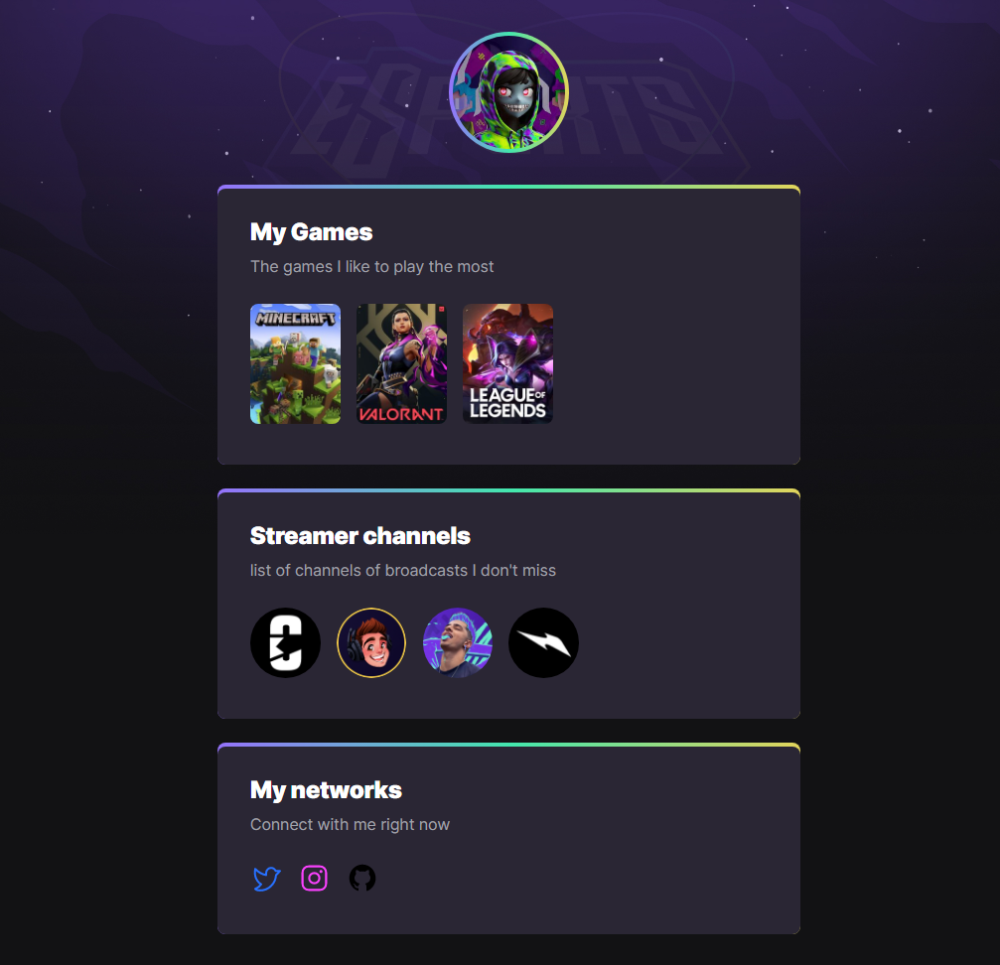

# NLW eSports

>💎 Explorer trail

Project built at Rocketseat
next Level Week event
With simplified and very intuitive construction!

See a photo of the Project below 👇

🔗 [Direct link to the project here](https://cyberthebaby.github.io/nlw-esports/)

## 🔧 Technologies Used

- HTML
- CSS
- Git
- Github

### Important Topics of this project

- Super fast to learn
- Intuitive and fun
- Some elements can be used in other design
- Educator Very friendly and straight to the point

[Maykbrito](https://github.com/maykbrito) - Instructor of this project

## 📞 Contact

cyberthebaby@gmail.com